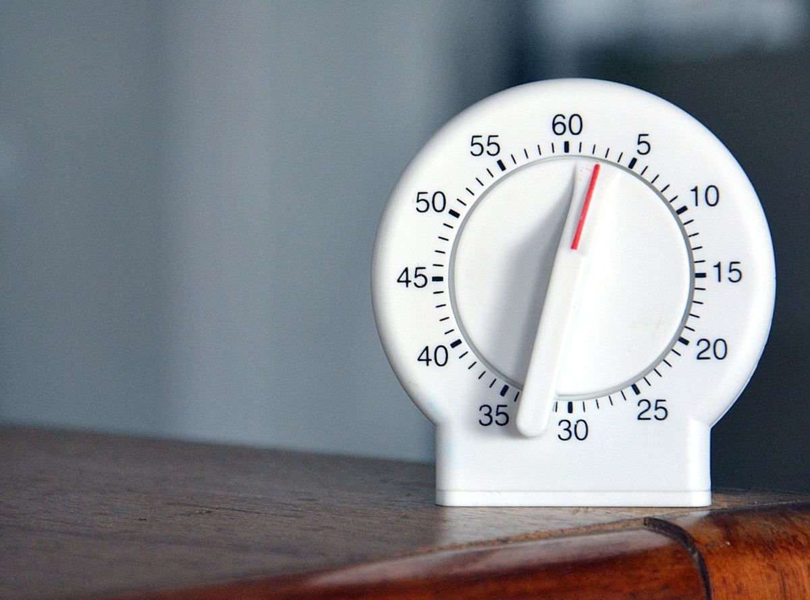

> A break at work is a period of time during a shift in which an employee is allowed to take time off from his/her job (Wikipedia).

### Guilt

Workers often feel guilty for standing up and taking a break. It's especially true for people in tech and the newcomers like interns or junior programmers. Hustling hard is the new norm. Not that I have anything against hard work, but you should play it smart to avoid getting [burned out](https://devhealth.io/burnout/).

### Benefits

Taking scheduled breaks during work is essential. It improves focus, keeps you from getting bored and helps you figure out a problem that you are stuck on.

When you are frustrated and stressing out over a hard task, taking a break and putting the work in subconscious mind may help solve it.

Walking, talking to coworkers or playing a video game can help you relax, and the insights will come more easily when in a relaxed state.

> "Walk and talk." One type of meetings that became popular recently is the walking meeting. Instead of sitting in a conference room, take a more active and personal approach and do a round or two around the block while talking and discussing. It's great if you need to address a creative problem or brainstorm about a problem solution.

### Lunch break

A great way to relax, socialize and de-stress during the workday is to take a lunch break. Almost all employers allow a 20 to 30 minutes long break for lunch.

In some Asian countries, it's common to take an after lunch nap. This is a practice among factory and office workers. You can notice people sleeping on public transportation. The napping culture and the benefits of restored energy after the short nap can be seen in some high tech companies as they provide sleeping pods or beds for employees.

### Methods

- Take a break from work at least every 2 hours. Move away from the workplace and walk or stretch out. Get some water, talk to the colleagues or take a short walk.

There are some well-known and researched time management methods that you can apply during the day, the most recognized is the Pomodoro technique.

> The Pomodoro Technique is a time management method developed by Francesco Cirillo in the late 1980s. The technique uses a timer to break down work into intervals, traditionally 25 minutes in length, separated by short breaks. Each range is known as a Pomodoro, from the Italian word for 'tomato,' after the tomato-shaped kitchen timer that Cirillo used as a university student. (Wikipedia)

There are also other methods, similar to the Pomodoro technique, like working in 90-minute work blocks. Another one is called 52-17 and it consists of working for 52 minutes and taking a break for 17 minutes.

All these techniques function the same, emphasizing that the human brain isn't meant to work for hours on end. Figure out the ideal length of a work block that works best for you and take a break in-between to refresh.

### Tools

If you tend to forget to take a break or don't use a strict Pomodoro technique app, take a look at [Stretchly](https://github.com/hovancik/stretchly).

It is a cross-platform open-source app that reminds you to take breaks when working with the computer. It'll notify you when to take a micro break and a regular break. Some micro break ideas are stretching, closing your eyes and standing up. Regular breaks are more prolonged, typically lasting 5 minutes and during these, you are encouraged to move away from the computer.

### Conclusion

Taking a break in the workday is important to replenish energy. Follow a common time management method or figure out what works for you. Using a tool such as Stretchly can help you develop the habit of taking breaks.

Do you use a time management method like the Pomodoro technique? If so, what is your experience with it?

### Resources

- https://hbr.org/2015/08/how-to-do-walking-meetings-right (Walking meetings)
- https://github.com/hovancik/stretchly (Stretchly app)
